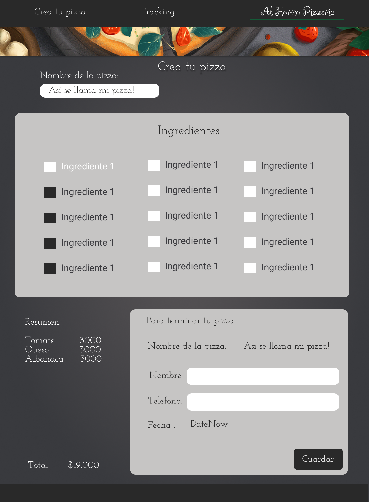

  

# Pizza Shop 

## Objetivos de la web app

* [x] Seleccionar de una lista de 15 ingredientes los que podrá tener la pizza, con diferente precio algunos ingredientes.
* [x] La cuenta de la orden empieza contando el precio de la base que son $10000. 
* [x] La orden de la pizza debe tener un nombre, teléfono, nombre de la pizza, la orden de ingredientes, el total de la compra.
* [x] Se debe poder conocer el tracking de ventas en un tablero. (tabla)

## Producto final

  

## Herramientas utilizadas

La web app fue creada con [Create React App](https://github.com/facebook/create-react-app).

Para almacenar la información de la orden usé [Firebase](https://firebase.google.com/docs/firestore/quickstart?hl=es-419), pensé en usar el local storage pero en está ocasión estoy demostrando mis conocimientos frente a está herramienta de google. 

Usé [react-router](https://reactrouter.com/web/guides/quick-start) para el ruteo de las opciones de vistas que tiene la web app. 

Encontré una libreria para formularios que en está ocasion no usaré pero que me parecio importante conocerla. [react Hook Form](https://react-hook-form.com/get-started).

## Prototipado

  

## Cómo ejecutar la web app.

Clonar el repositoria de pizzaShop.

Istalar los paquetes que instalé con `npm install`. 

correr `npm start` que abrirá el local host http://localhost:3000 para verlo en el navegador. 

## Q&A

¿Dónde almacenar la información de las ordenes?

a/ Como dije antes estaba entre las dos opciones de usar local storage o firebase, pero he usado más firebase en la mayoria de proyectos entonces opte por esa opción.

¿Manejar un formulario con varios inputs que podrian ser varios componentes? 

a/ dividi el formulario que se debia llenar en varios componentes, para poder jugar un poquito con el diseño que propuse. 

¿Qué manera podría usar para ver la información de las ordenes?
a/ Creo que las tablas ayudan mucho a la organización de los datos. Por eso muestro todo en tabla. 

¿Usar preprocesadores o alguna libreria para estilos?
a/ Css puro es mucho más fácil para mi que aún no he practicado con preprocesadores o librerias y más cuando hay poquito tiempo para presentarlo. 

