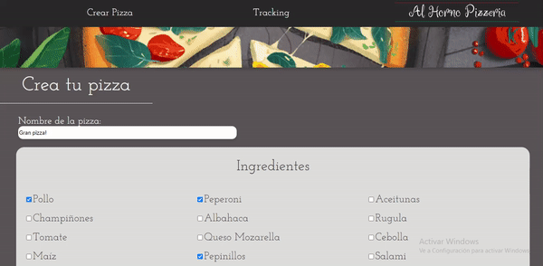

  

# Pizza Shop 

## Objetivos de la web app

* [x] Seleccionar de una lista de 15 ingredientes los que podrá tener la pizza, con diferente precio algunos ingredientes.
* [x] La cuenta de la orden empieza contando el precio de la base que son $10000. 
* [x] La orden de la pizza debe tener un nombre, teléfono, nombre de la pizza, la orden de ingredientes, el total de la compra.
* [x] Se debe poder conocer el tracking de ventas en un tablero. (tabla)
* [x] Realizar pruebas de lightHouse que en promedio esten sobre el 80%.
* [ ] Deseleccionar los productos que no iran en la orden de la lista de checkboxs.

## Producto final

  

## Herramientas utilizadas

La web app fue creada con [Create React App](https://github.com/facebook/create-react-app).

Para almacenar la información de la orden usé [Firebase](https://firebase.google.com/docs/firestore/quickstart?hl=es-419), pensé en usar el local storage pero en está ocasión estoy demostrando mis conocimientos frente a está herramienta de google. 

Usé [react-router](https://reactrouter.com/web/guides/quick-start) para el ruteo de las opciones de vistas que tiene la web app. 

Encontré una libreria para formularios que en está ocasion no usaré pero que me parecio importante conocerla. [react Hook Form](https://react-hook-form.com/get-started).

## Prototipado

  

## Cómo ejecutar la web app.

Clonar el repositoria de pizzaShop.

Instalar los paquetes que instalé con `npm install`. 

Correr `npm start` que abrirá el local host http://localhost:3000 para verlo en el navegador. 

## Q&A

- ¿Dónde almacenar la información de las ordenes?

Estaba entre las dos opciones de usar local storage o firebase, pero estoy familiarizada más con firebase y así que por el tiempo establecida era la herramienta que preferi usar, además de muchas funcionalidades que facilitaron su uso. Pensando también que se puede hacer un proyecto escalable partiendo de esto. 

- ¿Manejar un formulario con varios inputs que podrian ser varios componentes? 

Dividí el formulario que se debia completar, en varios componentes, para poder jugar un poco más con el diseño que propuse y para distribuir mejor los espacios. 

- ¿Qué manera podría usar para ver la información de las ordenes?

Creo que las tablas ayudan mucho a la organización y visualización de los datos. Por eso muestro el resumen y la información de las ordenes en tabla. 

- ¿Usar preprocesadores o alguna libreria para estilos?

He utilizado Css, porque por tiempo se me facilitaba más. En una futura iteracion podría implementar algún preprocesador como sass o alguna libreria.  

- ¿Dónde encuentro la info inicial?

Hay un json con los datos de todos los productos. 17 en total. 

- ¿Debía hacer pruebas o test?

Creo que para esto también se requeria más tiempo. No lo hice :(

- ¿Qué mejoraria en una próxima iteración?

En este momento selecciona varios ingredientes sin la posibilidad de retirar algún producto de la lista. Considero que es importante para la experiencia de usuario.

Hice todo el desarrollo pensando en web pero también considero que es importante tener en cuenta los dispositivos desde donde podrían entrar a la página. Es decir tener en cuenta el responsive de la web app.

